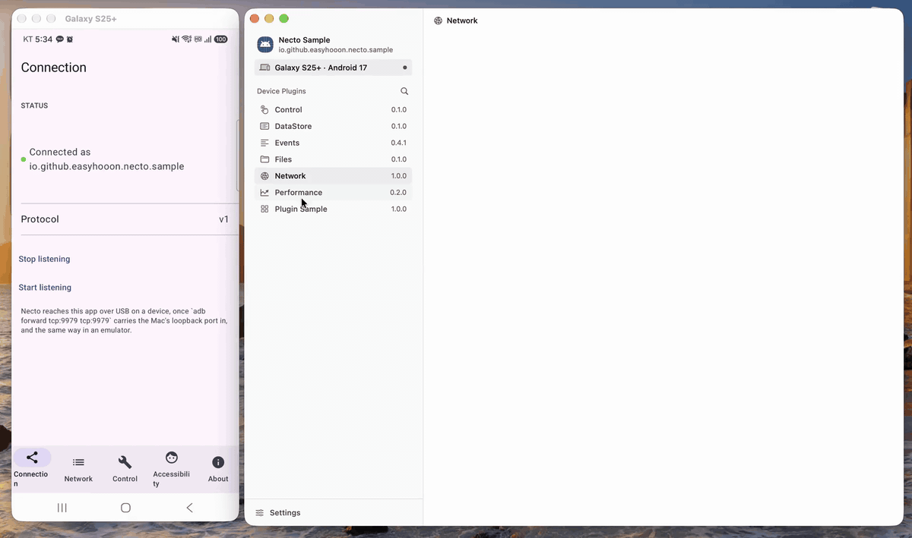

# necto-android

English | [한국어](README-ko.md)

> An unofficial project. It is not made or maintained by Toss (Viva Republica).



An Android port of the app-side SDK of [Necto](https://github.com/toss/necto), the iOS
debugging platform. Android apps connect to the unchanged Necto Mac app over the same
protocol (v1) as iOS apps and use the same web panels.

## Connecting

The SDK listens on `127.0.0.1:9979` inside the app, sliding up to 9986 when the port is
taken. Necto already probes those loopback ports for simulator apps, so one forward is
all it takes, with **no change to the Mac app**:

```bash
adb forward tcp:9979 tcp:9979
```

Each device is told apart by the handshake's `simulatorID`, `android:<ANDROID_ID>`.

- When a second SDK app runs on the same phone, it slides to 9980. Add
  `adb forward tcp:9980 tcp:9980` to see it too.
- To connect a second phone at the same time, forward it to another local port, such as
  `adb -s <serial> forward tcp:9980 tcp:9979`.
- Necto only probes 9979–9986, so a custom start port
  (`NectoAndroid.start(..., port = ...)`) must stay in that range.

## Modules

| Module | Contents | iOS counterpart |
| --- | --- | --- |
| `necto-core` (plain JVM) | Protocol models, JSON and schema validation, length-prefixed socket transport, coroutine SDK runtime, the shared part of the Events, Network, Performance, Files and UI Control plugins, web panels | `NectoModel`, `NectoTransport`, `NectoSDK`, `NectoDefaultPlugins` |
| `necto-android` | App identity from `Context`, DataStore Preferences plugin, process sampler (CPU, PSS, FPS, threads), UI Control for Views and Jetpack Compose, default Files roots | `NectoProcessMetrics`, the UIKit parts |
| `necto-okhttp` | Network capture with an OkHttp `Interceptor` | `NectoURLSessionCapture` |

## Usage

```kotlin
val Context.settings by preferencesDataStore("settings")

class App : Application() {
    override fun onCreate() {
        super.onCreate()
        if (BuildConfig.DEBUG) {
            val events = NectoEventsPlugin()
            val network = NectoNetworkPlugin()
            NectoAndroid.start(
                this,
                NectoAndroidPlugins.defaults(this, events, network, dataStores = mapOf("settings" to settings)),
            )

            okHttpClient = OkHttpClient.Builder()
                .addInterceptor(NectoOkHttpInterceptor(network))
                .build()
            events.report(NectoEvent(NectoEvent.Level.INFO, "App", "started"))
        }
    }
}
```

Custom plugins take the same shape as on iOS:

```kotlin
class ThingsPlugin : NectoPlugin {
    override val id = "com.example.things"
    override fun register(necto: NectoRegistrar) {
        necto.handle("things.list") { jsonObject("things" to jsonArray(...)) }
        necto.stream("things.observe") { _, out -> changes.collect { out.send(it) } }
    }
}
```

## Differences from iOS

- **Preferences**: Jetpack DataStore Preferences instead of `UserDefaults`. DataStore allows one instance per file, so the app hands over its own instances by name (`dataStores = mapOf("settings" to context.settings)`); the first is the default store. Long and Float values are edited as Int and Double in the panel and keep their stored type. ByteArray values are read-only.
- **Files roots**: `files`, `cache`, `data` (including `shared_prefs` and `databases`), `external`, `external-cache`.
- **Performance**: `memory` is total PSS, `resident-memory` is VmRSS, `compressed-memory` is VmSwap (zram), plus `java-heap` and `native-heap`.
- **Device name**: Necto shows `osVersion` as "iOS …", so the SDK leaves it empty and appends the Android version to the device name, such as `Pixel 9 · Android 16`.
- **UI Control**: reads the View tree and, when the app has Compose, each host's Jetpack Compose semantics tree (`compileOnly`, so View-only apps carry nothing extra). Coordinates are in pixels. Back is the system BACK key (`method: "backKey"`). Overlays that take no touches, such as edge-to-edge's `ProtectionLayout`, do not count as covering what is below. Dialogs and popups live in other windows and are not reached yet.
- **Panels** are packaged as Java resources (`necto/panels/<id>` with a `files.txt` index generated at build time).

## Sample app

`sample` ports Necto's iOS `ExampleApp` screen by screen, in Jetpack Compose with five tabs.

| Tab | Contents | iOS counterpart |
| --- | --- | --- |
| Connection | SDK status (port, connected app), protocol version, stop and start listening | `ConnectionView` |
| Network | Sample requests to a loopback REST server inside the app (`LocalApi`): GET, POST, PATCH, DELETE, a large response, a slow response, 404, 500, a DNS failure | `NetworkView`, `LocalAPI` |
| Control | The UI Control fixture in both Compose and Views (`AndroidView`), switched with chips. Labels and identifiers (`poc.*`) match iOS | `ControlFixtureController` |
| Accessibility | Compose fixture (`ax.*`): counter, disabled button, text field, detail, sheet, custom scroll | `AccessibilityFixture` |
| About | SDK and protocol versions | `AboutView` |

The custom plugin `plugin-sample` (`com.example.app.state`, `com.example.app.counter`) ships the same web panel as iOS, as Java resources under `sample/src/main/resources/panels/plugin-sample`. On launch the app seeds DataStore Preferences and `files/` with example values and files.

## Verification

[docs/verification.md](docs/verification.md) lists what was checked on a device with Necto 0.2.0 and what the automated tests cover.

## Building

```bash
./gradlew build                          # everything (needs Google Maven)
./gradlew -Pnecto.skipAndroid=true test  # JVM modules only
```

minSdk 26, compileSdk 35, Kotlin 2.0.21, AGP 8.7.3.

## License

MIT. The original Necto is © Viva Republica, Inc. See `LICENSE` and `NOTICE`.
